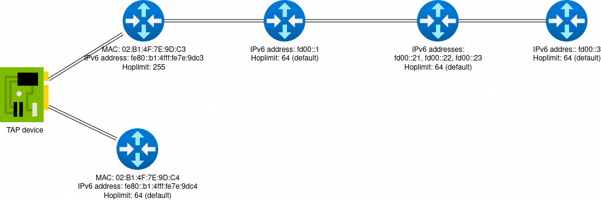

<!--
SPDX-FileCopyrightText: Copyright (C) 2024-2025 Marek Küthe <m.k@mk16.de>

SPDX-License-Identifier: GPL-3.0-or-later
-->

# mping-sender

[](https://ci.codeberg.org/repos/13147)
[](https://www.bestpractices.dev/projects/8694)

mping-sender is a simple multicast transmitter that sends a UDP packet every second.

What happens if a traceroute with the same TTL/hop limit is received from two different source addresses? How will they react?

crazytrace is a network simulation program that can be used to see how different ping and traceroute implementations react when the sender address is different than expected.

## And what the hell does crazytrace do now? Simply explained.

When a network packet is used, it passes through several devices (also known as routers) on its journey to its destination. There are "traceroute" programs to determine these devices and thus the path that the packet takes. These usually query the path several times. What would happen if a certain device has two addresses on this path with which it responds? To see how the programs behave in this case, crazytrace simulates such a device (or several, depending on the configuration). This is achieved by creating a virtual Ethernet adapter behind which the simulated device or the simulated devices are located.

## Building

See [BUILDING.md](BUILDING.md).

## Contributing

See [CONTRIBUTING.md](CONTRIBUTING.md).

## Security

On Linux, crazytrace uses three sandboxing technologies or restriction technologies: Capabilities, seccomp and landlock, systemd, and AppArmor.
These serve to limit the extent of compromise if crazytrace is compromised by an attack.

libcap-ng, seccomp, and landlock are used in two phases in crazytrace:

1. In the first phase, which lasts only a few milliseconds, crazytrace is initialized: The configuration file is read, the TAP device is created, and the post-up commands are started.
2. In the second phase, an IO loop is entered. In this loop, crazytrace only reads from the TAP device and responds.

### Capabilities

In Linux, capabilities are used to restrict what a program is allowed to do, especially when interacting with the system. crazytrace requires two capabilities: `CAP_NET_ADMIN` and `CAP_SETPCAP`.
`CAP_NET_ADMIN` is required to create the TAP device and, if necessary, for the post-up commands.
`CAP_SETPCAP` is required to restrict its own capabilities.
systemd and AppArmor ensure on Linux that crazytrace does not receive any other capabilities.
crazytrace uses libcap-ng to drop all unnecessarily granted capabilities in phase 1. Once dropped, these cannot be re-granted. The post-up commands only receive the `CAP_NET_ADMIN` capability, but not the `CAP_SETPCAP` capability. In phase 2, all capabilities are dropped.
Furthermore, libcap-ng performs a "lock": If supported, NoNewPriv and securebits are set.

### Seccomp

crazytrace uses various libraries. These libraries use syscalls. However, it is not documented which ones they use. Creating a whitelist - especially one that is distribution-independent - has therefore proven difficult.
For this reason, seccomp is used to blacklist syscalls that crazytrace does not need.

### Landlock

Landlock can restrict what a program can access. In phase 1, crazytrace is restricted by landlock so that it never blocks necessary accesses.
In phase 2, all accesses are blocked. This is possible because crazytrace has been fully initialized in phase 1 and landlock only restricts new accesses. Therefore: The TAP device can be opened in phase 1 and continue to be used in phase 2.

Landlock offers backward compatibility with older kernels through a dynamic ABI query. However, to reduce maintenance effort, a certain Landlock version is required. This should be based on Debian.

### AppArmor

AppArmor restricts crazytrace by determining what crazytrace is allowed to do. Unnecessary operations are therefore blocked by AppArmor.

### systemd

crazytrace comes with a hardened systemd unit that restricts many accesses not used by crazytrace.

See [SECURITY.md](SECURITY.md).

## How it works?

crazytrace uses several libraries and tricks to create a virtual TAP adapter behind which the simulated network is hidden.

Libraries used:

- [libtuntap](https://github.com/LaKabane/libtuntap/): This library is used to create and close the TAP device.
- [libtins](https://libtins.github.io/): This library is used for packet parsing and crafting.
- [yaml-cpp](https://github.com/jbeder/yaml-cpp/): This library is used to read the configuration file in YAML format.
- [Boost.log](https://www.boost.org/): This library is used as a logger. Various log levels can be set in the configuration file.
- [Boost.Asio](https://www.boost.org/): This library is used to communicate with the socket of the TAP device and to receive and send several packets asynchronously.

Optional libraries:

- [libcap-ng](https://people.redhat.com/sgrubb/libcap-ng/): Used to discard unnecessary capabilities and restrict the program.
- [libseccomp](https://github.com/seccomp/libseccomp): Used to block potentially dangerous system calls.
- [landlock](https://landlock.io/): Used to restrict access.

Here is how the program works:

1. reading the configuration file
2. setting the log level
3. output of the libtuntap version
4. output of the configuration
5. creation of the TAP device
6. initialization of the network simulator
7. starting the network simulator

The following is how the network simulator works when a packet is received:

1. reading the packet with tins
2. reading the packet into a NodeRequest
3. generate a NodeReply using the configuration
4. check whether a reply should be sent
    1. If no, abort
    2. if yes, create a NodeReply packet using libtins
5. write the packet to the socket of the TAP device

## Configuration file

The following is a example configuration file:

```yaml
---
log_level: info
device_name: crazytrace
post_up_commands:
  - ip route add fd00::/64 dev crazytrace via fe80::b1:4fff:fe7e:9dc3
nodes:
  - mac: 02:B1:4F:7E:9D:C3
    addresses: [fe80::b1:4fff:fe7e:9dc3]
    hoplimit: 255
    nodes:
      - addresses: [fd00::1]
        nodes:
          - addresses: [fd00::21, fd00::22, fd00::23]
            nodes:
              - addresses: [fd00::3]
  - mac: 02:B1:4F:7E:9D:C4
    addresses: [fe80::b1:4fff:fe7e:9dc4]
```

This would generate the following topology:


The log level can have one of the following values:

- `trace`
- `debug`
- `info`
- `warning`
- `error`
- `fatal`

For production, "info" or lower is recommended.

The device name is the name of the TAP interface that crazytrace creates.

The post-up commands are a series of commands that are executed by the command processor of the operating system after the TAP interface has been created. These commands are executed with the same rights as crazytrace. They receive no input. Their output is ignored. crazytrace aborts if one of the commands has not been successfully completed.

A list of nodes then appears in the configuration file. These can have the following attributes:

- `mac`: The nodes in the first level must have a MAC address. crazytrace acts as if these nodes were directly on the TAP interface. All child nodes of these are behind them, so that no MAC address is required for communication.
- `addresses`: A list of IP addresses that the node should have. It responds to all of them and replies with a random one.
- `hoplimit`: Hop limit with which the response is to be sent. ICMP NDP packets are always sent with a hop limit of 255. If no hop limit is specified, a hop limit of 64 is used.
- `nodes`: A list of nodes (which are structured in the same way) which are behind the current one in the simulated network.

The configuration is written in YAML.

### Which MAC addresses can I use without any problems?

The following belong to the locally administered range and can be used without any problems:

```
x2-xx-xx-xx-xx-xx
x6-xx-xx-xx-xx-xx
xA-xx-xx-xx-xx-xx
xE-xx-xx-xx-xx-xx
```

## How do I start crazytrace?

crazytrace is configured via a configuration file. The path to this file is given as the first (and only) argument.

```
# /path/to/crazytrace /path/to/config.yaml
```

## Notes for myself

### Create a new release

To create a new release the following is necessary:

- Create a changelog entry
- Create a changelog entry for the Debian package
- Update the SECURITY.md
- Create a new git tag
